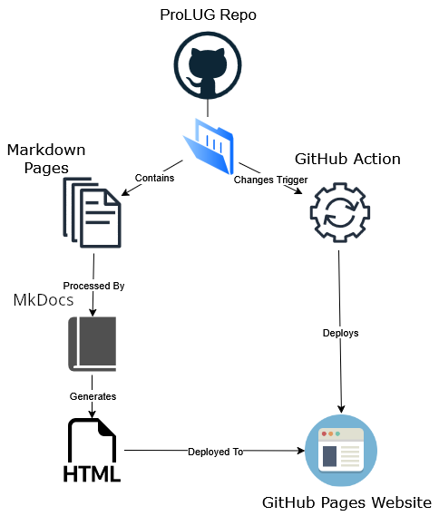

# Contributing and Local Development

It is strongly encouraged that contributors test their changes before making
commits. To help facilitate this process a set of instructions and guidelines
are provided below. These guidelines are by no means a requirement or the only
set of procedures to locally develop on this project.

The examples, code, and commands provided below were developed using such
technologies as containers, bash scripts, and more.

## Build Dependencies

---

The ProLUG course books utilize [Material for MkDocs](https://squidfunk.github.io/mkdocs-material/), a friendly
and popular markdown utility that quickly exports static web files for documentation or general website use cases.

Utilizing Material for MkDocs this course then deploys the exported web structure to a Git Pages workflow and runner
that then produces an easily navigable website.

Below is the current workflow that deploys the Git Page for the course:



To achieve this deployment locally the following environment and dependencies are
required:

1. A localhost, this could be a container, virtual machine, or local machine
2. The following packages installed on such machine:

   - httpd or apache
   - git
   - mdBook binary

3. And a clone of a ProLUG repository

## Building, Deploying, and Developing Locally

---

Below is a set of scripts that can quickly achieve this environment in an automated fashion.

These commands assume a `root` user. This script will update and upgrade host packages to
their latest versions, install git, curl, tar, gzip, grep and their dependencies if they aren't present,
attempt to pull down the latest fully compiled `mdbook` binary from the official mdBook GitHub repository, boot
up the local web server, process and produce the necessary .html files from the LAC source files, deploy
the website and necessary cleanup operations.

Outside of system packages all files will be localized to the `/root/lac` directory on the container or machine.

APT frontends:

```bash
#!/bin/bash
apt-get -y install apache2 git curl tar gzip grep
cd && git clone https://github.com/ProfessionalLinuxUsersGroup/lac && cd $HOME/lac
VERSION=$(curl -sL https://github.com/rust-lang/mdBook/releases/latest | grep -Po -m 1 'v(?:\d\.){2}\d+')
curl -sLO "https://github.com/rust-lang/mdBook/releases/download/${VERSION}/mdbook-${VERSION}-x86_64-unknown-linux-gnu.tar.gz"
tar xfz mdbook-${VERSION}-x86_64-unknown-linux-gnu.tar.gz
rm -f mdbook-${VERSION}-x86_64-unknown-linux-gnu.tar.gz
systemctl enable --now apache2
$PWD/mdbook build -d /var/www/html
systemctl restart apache2
unset VERSION
```

DNF frontends:

```bash
#!/bin/bash
dnf install -y httpd git curl tar gzip grep
cd && git clone https://github.com/ProfessionalLinuxUsersGroup/lac && cd $HOME/lac
VERSION=$(curl -sL https://github.com/rust-lang/mdBook/releases/latest | grep -Po -m 1 'v(?:\d\.){2}\d+')
curl -sLO "https://github.com/rust-lang/mdBook/releases/download/${VERSION}/mdbook-${VERSION}-x86_64-unknown-linux-gnu.tar.gz"
tar xfz mdbook-${VERSION}-x86_64-unknown-linux-gnu.tar.gz
rm -f mdbook-${VERSION}-x86_64-unknown-linux-gnu.tar.gz
systemctl enable --now httpd
$PWD/mdbook build -d /var/www/html
systemctl restart httpd
unset VERSION
```

The ProLUG Linux Administration Course website should now be available from your
web browser either at http://localhost or its designated IP address.

#### From here you can use such commands from your localhost to implement changes:

```bash
cd {working lac directory} #for example: /root/lac or ~/lac
$HOME/lac/mdbook build -d /var/www/html
systemctl restart {httpd or apache}
```

These commands will switch your shell into the appropriate directory, execute
the necessary cargo binaries located in its installed PATH, build the mdBook
from any files that were changed, and then finally restart the web server.

From there you should be able to see any changes you have made are reflected.

#### Or send commands over to a networked container or machine:

**Note:** To minimize complexity and given the nature of commands over SSH,
these commands will need to utilize absolute paths.

```bash
scp {working directory}/{targeted document} {TARGET_IP}:/root/lac/src/{targeted document}
ssh {TARGET_IP} "cd /root/lac && /root/lac/mdbook build -d /var/www/html && systemctl restart httpd"
```

An example of the workflow after making changes:

```bash
scp src/development.md 172.16.15.8:/root/lac/src/
ssh 172.16.15.8 "cd /root/lac && /root/lac/mdbook build -d /var/www/html && systemctl restart httpd"
```


