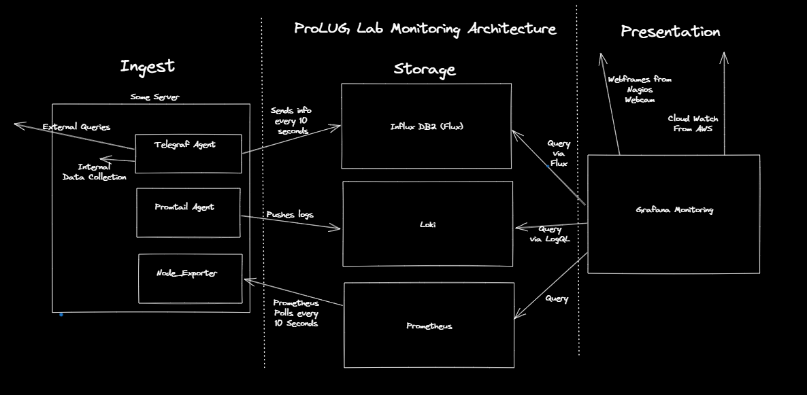

# Unit 11 Lab - Monitoring

!!! info

    If you are unable to finish the lab in the ProLUG lab environment we ask you `reboot` the machine from the command line so that other students will have the intended environment.

### Resources / Important Links

- [Killercoda Labs](https://killercoda.com/learn)

### Required Materials

- Rocky 9.4+ - ProLUG Lab
    - Or comparable Linux box
- root or sudo command access

#### Downloads

The lab has been provided for convenience below:

- <a href="../../assets/lac/downloads/u11/u11_lab.pdf" target="_blank" download>📥 u11_lab(`.pdf`)</a>
- <a href="../../assets/lac/downloads/u11/u11_lab.docx" target="_blank" download>📥 u11_lab(`.docx`)</a>

### Setup monitoring with Grafana

1. Run through each of the three labs below in Killercoda:
    - <https://killercoda.com/het-tanis/course/Linux-Labs/102-monitoring-linux-logs>
    - <https://killercoda.com/het-tanis/course/Linux-Labs/103-monitoring-linux-telemetry>
    - <https://killercoda.com/het-tanis/course/Linux-Labs/104-monitoring-linux-Influx-Grafana>

2. While completing each lab think about the following:
    1. How does it tie into the diagram below?
    2. What could you improve, or what would you change based on your previous administration experience.

### Conclusion

In the end monitoring is more an art than engineering. Sure, we can design all the systems to track all
the things, but there’s no equation on what is the one right answer for any of this. You have to spend
time with the systems, know what is important and what is an indicator of problems. Then, you have to
consider your audience and how to best show them what they need to see.

!!! info

    Be sure to `reboot` the lab machine from the command line when you are done.
